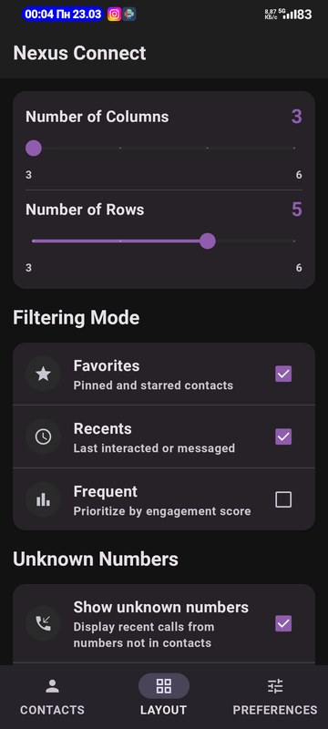
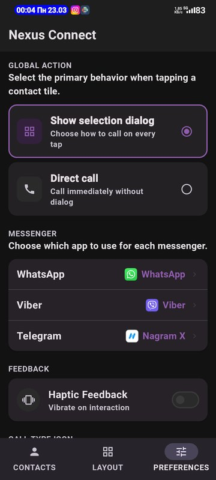
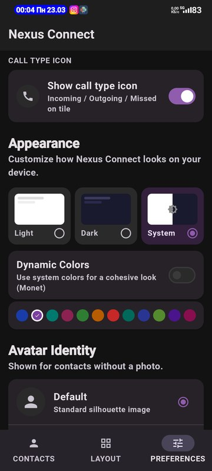
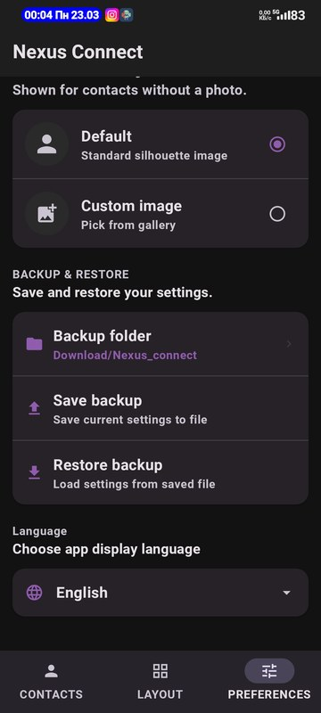

# Nexus Connect

<p align="center">
  
</p>

<p align="center">
  <strong>A home screen widget that puts your most important contacts one tap away.</strong><br/>
  <em>Виджет рабочего стола, который делает нужные контакты доступными одним нажатием.</em>
</p>

<p align="center">
  <a href="#english">English</a> · <a href="#русский">Русский</a>
</p>

---

<a name="english"></a>
## 🇬🇧 English

### Screenshots

<p align="center">
  
  
  
</p>
<p align="center">
  
  
  
</p>

---

### What is Nexus Connect?

Nexus Connect is a free, open-source Android widget app. Instead of unlocking your phone → opening the dialer → scrolling through hundreds of contacts → tapping a name, you just tap a face on your home screen. That's it.

### Features

#### Widget
- **Flexible grid** — from 3×3 up to 6×6 tiles
- **Full-quality photos** — served via ContentProvider, no blurry thumbnails
- **Call type badges** — small icon on each tile showing the last call direction:
  - 🟢 Incoming · 🔵 Outgoing · 🔴 Missed · 🟡 Rejected · ⚫ Unknown
- **Unknown numbers** — recent calls from numbers not in your contacts can appear on the widget too, with a configurable time window (1 day / 3 days / 7 days / unlimited)
- **Auto-updates** after every call, even when the app is killed (manifest BroadcastReceiver)

#### Contact Selection
- Manually pin favorites and reorder them with arrow buttons
- Auto-fill from call log: **Most Frequent** or **Most Recent**
- Mix modes — favorites on top, recents fill remaining tiles

#### On Tap
- **Dialog mode** — bottom sheet with contact photo, call stats (count, total duration, last call date/time), and quick-launch buttons for Phone / WhatsApp / Viber / Telegram
- **Direct call** — one tap, instant call, no extra screens
- **Haptic feedback** — works on MIUI and stock Android

#### Appearance
- Light / Dark / System theme
- **Dynamic colors** (Monet, Android 12+)
- 12 accent colors if you prefer a fixed palette
- **Custom fallback avatar** — pick any image from gallery for contacts without photos

#### Backup & Restore
- Settings exported to an **AES-256 encrypted ZIP** file
- File name = timestamp, extension `.nexbkup`
- Choose your backup folder once; custom file picker shows only your backups

#### Language
- **English** and **Russian** — switch in settings, applies instantly

#### Privacy
- **No internet permission** — the app literally cannot connect to the internet
- No ads, no analytics, no accounts, no cloud
- Everything stays on your device

---

### Installation

1. Go to [Releases](https://github.com/toxictrace/Nexus-connect/releases)
2. Download the latest `app-release-signed.apk`
3. Install on your Android device (Android 8.0+)
4. Add the **Nexus Connect** widget to your home screen
5. Open the app to select contacts and configure settings

> **Note:** Play Protect may warn about the APK because it is self-signed.  
> The source code is fully open — you can build and verify it yourself.

---

### Permissions

| Permission | Why |
|---|---|
| `READ_CONTACTS` | Display contacts on the widget |
| `READ_CALL_LOG` | Recent / frequent contacts, call type badges |
| `CALL_PHONE` | Direct call from widget without opening dialer |
| `READ_PHONE_STATE` | Detect call end to refresh widget automatically |
| `VIBRATE` | Haptic feedback on tap |

---

### Building from Source

```bash
git clone https://github.com/toxictrace/Nexus-connect.git
cd Nexus-connect
./gradlew assembleDebug
```

Requires **JDK 17+** with Gradle.  
Min SDK: **26 (Android 8.0)** · Target SDK: **34 (Android 14)**

---

### Tech Stack

- **Kotlin** + **Jetpack Compose**
- **AppWidget RemoteViews** for the widget layer
- **DataStore** for settings persistence
- **Coil** for image loading in the app UI
- **ContentProvider** for full-resolution widget photos
- **AES-256 / CBC** + **ZIP** for backup encryption

---

### License

MIT License — see [LICENSE](LICENSE)

---

<a name="русский"></a>
## 🇷🇺 Русский

### Скриншоты

<p align="center">
  
  
</p>
<p align="center">
  
  
  
</p>

---

### Что такое Nexus Connect?

Nexus Connect — бесплатное приложение с открытым исходным кодом для Android. Вместо того чтобы разблокировать телефон → открывать звонилку → листать сотни контактов → нажимать на имя, вы просто нажимаете на фотографию на рабочем столе. Вот и всё.

### Возможности

#### Виджет
- **Гибкая сетка** — от 3×3 до 6×6 плиток
- **Фотографии в полном качестве** — через ContentProvider, без размытых миниатюр
- **Иконки типа звонка** — маленький значок на каждой плитке показывает последний звонок:
  - 🟢 Входящий · 🔵 Исходящий · 🔴 Пропущенный · 🟡 Отклонённый · ⚫ Неизвестный
- **Неизвестные номера** — недавние звонки с номеров не из контактов тоже могут отображаться на виджете, с настраиваемым периодом (1 день / 3 дня / 7 дней / без ограничений)
- **Автообновление** после каждого звонка, даже если приложение закрыто

#### Выбор контактов
- Вручную закрепляйте избранных и меняйте их порядок стрелками
- Автозаполнение из журнала звонков: **Частые** или **Недавние**
- Комбинируйте режимы — избранные сверху, остальные плитки заполняются автоматически

#### При нажатии
- **Диалог** — нижняя панель с фото контакта, статистикой звонков (количество, общее время, дата последнего звонка) и кнопками для Phone / WhatsApp / Viber / Telegram
- **Прямой звонок** — одно нажатие, мгновенный звонок без лишних экранов
- **Вибрация** — работает на MIUI и стандартном Android

#### Внешний вид
- Светлая / Тёмная / Системная тема
- **Динамические цвета** (Monet, Android 12+)
- 12 акцентных цветов для фиксированной палитры
- **Свой аватар** — выберите любое изображение из галереи для контактов без фото

#### Резервное копирование
- Настройки экспортируются в **AES-256 зашифрованный ZIP** файл
- Имя файла = дата и время, расширение `.nexbkup`
- Выберите папку один раз; встроенный диалог показывает только ваши резервные копии

#### Язык
- **English** и **Русский** — переключение в настройках, применяется мгновенно

#### Конфиденциальность
- **Нет разрешения на интернет** — приложение физически не может подключиться к сети
- Нет рекламы, аналитики, аккаунтов, облака
- Все данные остаются на вашем устройстве

---

### Установка

1. Перейдите в [Releases](https://github.com/toxictrace/Nexus-connect/releases)
2. Скачайте последний `app-release-signed.apk`
3. Установите на Android-устройство (Android 8.0+)
4. Добавьте виджет **Nexus Connect** на рабочий стол
5. Откройте приложение, выберите контакты и настройте параметры

> **Примечание:** Play Protect может предупредить об установке, так как APK подписан своим ключом.  
> Исходный код полностью открыт — вы можете собрать и проверить его самостоятельно.

---

### Разрешения

| Разрешение | Зачем |
|---|---|
| `READ_CONTACTS` | Отображение контактов на виджете |
| `READ_CALL_LOG` | Недавние / частые контакты, иконки типа звонка |
| `CALL_PHONE` | Прямой звонок с виджета без открытия звонилки |
| `READ_PHONE_STATE` | Определение окончания звонка для обновления виджета |
| `VIBRATE` | Вибрация при нажатии |

---

### Сборка из исходников

```bash
git clone https://github.com/toxictrace/Nexus-connect.git
cd Nexus-connect
./gradlew assembleDebug
```

Требуется **JDK 17+** с Gradle.  
Min SDK: **26 (Android 8.0)** · Target SDK: **34 (Android 14)**

---

### Стек технологий

- **Kotlin** + **Jetpack Compose**
- **AppWidget RemoteViews** — слой виджета
- **DataStore** — хранение настроек
- **Coil** — загрузка изображений в UI
- **ContentProvider** — фотографии в полном разрешении в виджете
- **AES-256 / CBC** + **ZIP** — шифрование резервных копий

---

### Лицензия

MIT License — см. [LICENSE](LICENSE)
